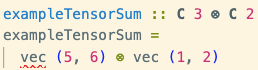

# Typed Fusion Categories

This is an exploratory Haskell library for working with maps between representations (i.e. symmetry-respecting linear maps, or intertwiners), in the vein of TensorKit.

The unique feature is that it is written in Haskell, which has a type system that is much much more expressive than Julia, and can encode the relevant mathematical structure of e.g. spin representations in the types themselves. For example, we can write

```haskell
x :: C 2 ⊗ C 3
x = vec (1,2) ⊗ vec (4,5,6)
```

The top line specifies the type, and should be read as the mathematical statement $x \in \mathbb{C}^2 \otimes \mathbb{C}^3$.

Haskell really checks this. For example, if you write

```haskell
x = vec (1,2) ⊗ vec (4,5)
```

you will see the mistake underlined in red, like so:

 

indicating a type error: the second vector is in $\mathbb{C}^2$, but should be in $\mathbb{C}^3$, given the stated type. The code will not compile. 


## Fusion at the type level

Length indexed arrays are pretty standard -- the novel idea is to be able to encode fusion rules at the type level. For example:


<!-- of this library is to write symmetry-respecting linear maps (intertwiners). Like TensorKit, the representation of intertwiners takes advantage of Schur's lemma to massively reduce the amount of storage needed for a large linear map. Unlike TensorKit, everything is checked at compile time. For instance: -->

<!-- naiveTensorProduct :: Unfused SU2 ('Irrep (Spin (1/2)) :⊗: 'Irrep (Spin (1/2)))
naiveTensorProduct = vec (1,2) ⊗ vec (3,4) ^+^ vec (5,6) ⊗ vec (7,8) -->

```haskell
ex1 :: Unfused SU2 (Dual ('Irrep (Spin (1/2)) :⊗: 'Irrep (Spin (1/2))) :⊗: 'Irrep (Spin (1/1)))
ex1 =  ((vec (1,2) ⊗ vec (1,2)) ⊗ vec (1,2,3)) ^+^ (vec (4,2) ⊗ vec (1,2)) ⊗ vec (1,2,7)
```

`Unfused SU2 ('Irrep (Spin (1/2)) :⊗: 'Irrep (Spin (1/2)))` is what you'd write in maths as $(\frac{1}{2} \otimes \frac{1}{2})^*\otimes 1$, i.e. the tensor product of two spin-1/2 representations, or concretely $\mathbb{C}^2 \otimes \mathbb{C}^2 \otimes \mathbb{C}^3$. The second line of `ex1` is a value of this type, namely a vector in this space. As you'd expect, the lengths of the arrays are checked at compile time.

By contrast, the fused version looks like:

<!-- fusedExample :: Fused SU2 ('Irrep (Spin (1/2)) :⊗: 'Irrep (Spin (1/2)))
fusedExample = (konst 1, vec (4,5,6)) -->

```haskell
ex2 :: Fused SU2 (Dual (Irrep (Spin (1/2)) :⊗: 'Irrep (Spin (1/2))) :⊗: Irrep (Spin (1/1)))
ex2 = (vec (1,2,3), (konst 1, (vec (2,3,4), vec (5,6,7,8,9))))
```

Here, the type `Fused SU2 (Dual (Irrep (Spin (1/2)) :⊗: Irrep (Spin (1/2))) :⊗: Irrep (Spin (1/1)))` is the space $(1 \oplus 0 \oplus 1 \oplus \frac{3}{2})$, or concretely $\mathbb{C}^3 \oplus \mathbb{C}^1\oplus \mathbb{C}^3 \oplus \mathbb{C}^5$. Haskell computes this for you *at the type level*, so if you tried to change the number of elements in `vec (2,3,4)` for example, it would instantly complain.

And finally:

```haskell
ex3 :: Sym SU2 (Dual (Irrep (Spin (1/2)) :⊗: Irrep (Spin (1/2))) :⊗: Irrep (Spin (1/1)))
ex3 = konst 1
```

Here, we keep only the trivial sectors, of which there is just one in this case.

<!-- As an example, we can look at the action of a random element of SU(2) on a random element of the space $(1/2 \otimes 1/2)$:

```haskell
sampleFusedHalfHalfAction :: IO ()
sampleFusedHalfHalfAction = do
  g <- generate (arbitrary :: Gen SU2Element)
  v <- generate (arbitrary :: Gen FusedHalfHalf)
  let v' = actsOnFused @SU2 @('Irrep (Spin (1/2)) :⊗: 'Irrep (Spin (1/2))) g v
      trees = makeFTrees @(ObjTrees SU2 ('Irrep (Spin (1/2)) :⊗: 'Irrep (Spin (1/2))))
  putStrLn $ "g: α=" ++ ppComplex (su2Alpha g) ++ " β=" ++ ppComplex (su2Beta g)
  putStrLn $ "v:  " ++ ppFTreeV (trees v)
  putStrLn $ "g·v:" ++ ppFTreeV (trees v')
  putStrLn $
    if fusedHalfHalfApproxEq v v'
      then "(unchanged)"
      else "(changed)"
```

This prints:

```bash
g: α=-0.5677+4.65e-2i β=0.5754-0.5869i
v:  [j=0: [0.3048+0.7993i], j=2: [-0.6498-4.42e-2i, -0.338+0.5466i, -6.33e-2+0.409i]]
g·v:[j=0: [0.3048+0.7993i], j=2: [-6.84e-2-0.3461i, -0.333-0.7278i, -0.4246-0.2513i]]
``` -->

## Fusion trees

In order to do f-moves properly, the types need to keep track of fusion trees. This took work, and isn't quite complete yet. But most of the operations you'd expect to do in a braided monoidal category are there. Here's an example:

```haskell
compose
  :: forall {κ} (hom :: κ -> κ -> Type) (⊗ :: κ -> κ -> κ) (a :: κ) (b :: κ) (c :: κ)
   . (CompactClosed hom ⊗ a b c)
  => hom Id (Dual a ⊗ b)
  -> hom Id (Dual b ⊗ c)
  -> hom Id (Dual a ⊗ c)
compose nf ng =
    (id ⊗ idl)
  . (id ⊗ (counit ⊗ id))
  . (id ⊗ disassociate)
  . associate
  . bimap nf ng
  . coidr
```


<!-- ```haskell
composeFGSteps :: FTreeV (ObjTrees SU2 (Dual Half :⊗: Half))
composeFGSteps = step5
  where
      step1 :: FTreeV (ObjTrees SU2 ((Half :⊗: Half) :⊗: (Half :⊗: Half)))
      step1 = fuseFTreesTerm f g
      step2 :: FTreeV (ObjTrees SU2 (Half :⊗: (Half :⊗: (Half :⊗: Half))))
      step2 = fmoveOuterHom @'[HalfTree] @'[HalfTree] @'[HalfTree] step1
      step3 :: FTreeV (ObjTrees SU2 (Half :⊗: (Half :⊗: Half :⊗: Half)))
      step3 =
        idRight @'[HalfTree]
          (fmoveInvTrees @'[HalfTree] @'[HalfTree] @'[HalfTree])
          step2
      step4 :: FTreeV (ObjTrees SU2 (Half :⊗: ('Irrep 0 :⊗: Half)))
      step4 =
        idRight @'[HalfTree]
          (idLeft @_ @_ @'[HalfTree] (cup @'[HalfTree]))
          step3
      step5 :: FTreeV (ObjTrees SU2 (Half :⊗: Half))
      step5 = idRight @'[HalfTree] (unitor @'[HalfTree]) step4
``` -->

which directly corresponds to the five morphisms:

$$
\begin{aligned}
f \otimes g
  &\colon (a^{\ast}\otimes b)\otimes(b^{\ast}\otimes c) \\
  &\xrightarrow{F}
    a^{\ast}\otimes\bigl(b\otimes(b^{\ast}\otimes c)\bigr) \\
  &\xrightarrow{\mathrm{id}\otimes F}
    a^{\ast}\otimes\bigl((b\otimes b^{\ast})\otimes c\bigr) \\
  &\xrightarrow{\mathrm{id}\otimes(\varepsilon\otimes\mathrm{id})}
    a^{\ast}\otimes(\mathbf{1}\otimes c) \\
  &\xrightarrow{\mathrm{id}\otimes\lambda}
    a^{\ast}\otimes c\,.
\end{aligned}
$$

Note that the type in the code above is precise, but very general. It says: for any compact closed category, and any objects $a$, $b$, $c$, if you give me morphisms $f : I \to a^* \otimes b$ and $g : I \to b^* \otimes c$, I will give you a morphism $f \circ g : I \to a^* \otimes c$. Having precise types like this lets you write general (in this case, category-level) code that specializes to specific cases automatically; think of it as a more powerful version of what multiple dispatch in Julia gives you.

# Why do this?

## Answer for physicists

Without statically checked types, it is very easy to make mistakes when working with this kind of abstract algebra. It is also very easy to lose track of what the shapes of arrays should be. By checking and infering types at compile time, this approach offers a solution to both.

More broadly, this library is an exploration of the idea that tensor network libraries should be written in languages with expressive types, by which I mean **types that correspond to mathematical spaces**. 

A more extreme version would be to use Lean, where the types are in principle powerful enough to prove various theorems (e.g. you don't need to assume Schur's lemma or hard code various 6j symbols - you could actually write a program that proves it / derives them). Haskell is a nice middle ground, where the types are expressive, but the compiled code is fast. Slower than Julia, but backends to Blas and LAPACK routines in C.

## Answer for computer scientists

This is a really nice programming language theory problem. Fusion categories have quite rich structure, and being able to reflect them in the type system is an appealing challenge.

# What is and isn't implemented

Currently things work for $U(1)$ and $SU(2)$, but not for other groups yet. I also want to generalize the interface to fusion categories that aren't categories of representations, like the Fibonacci fusion category, or the Ising fusion category, which is only part done.

# How this works

Getting this to work requires quite a bit of type-level programming, including singletons. From a user perspective, this is all under the hood.

# AI usage

Type-level programming is a bit of an art in Haskell, since it pushes the limits of the type system, often with experimental features. Since I don't particularly care *how* the fancy dependent types are implemented with singletons and so on, this is where I delegated the most to AI.

But I have pretty strong opinions on how the types should look (and how good Haskell should look too), so this project is "human-led", as it were.

# Using the library

This is still a work in progress. It compiles and works, but if you're interested in using it, feel free to contact me!
